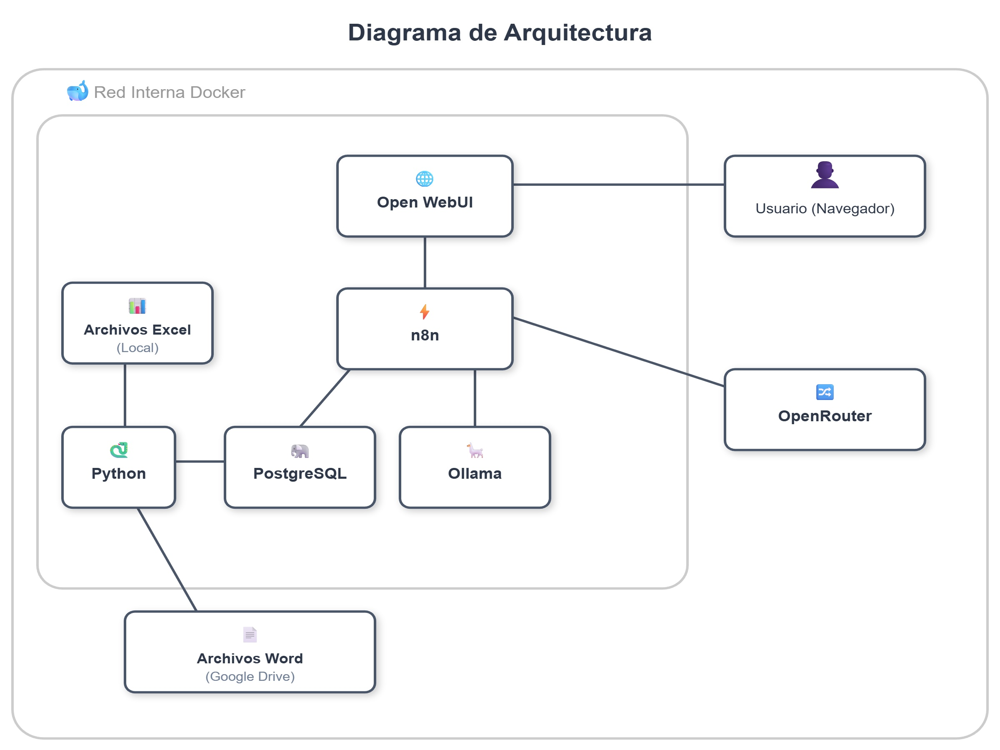

# Prototipo de Asistente Virtual Académico (Chatbot) basado en Inteligencia Artificial (IA) para Estudiantes de Licenciatura en Sistemas

## Universidad Nacional de Lanús - Licenciatura en Sistemas

[](https://www.docker.com/)
[](https://www.postgresql.org/)
[](https://www.python.org/)
[](https://n8n.io/)
[](https://ollama.ai/)
[](https://github.com/open-webui)

---

## 📋 Descripción del Proyecto

Prototipo de asistente virtual académico desarrollado como Trabajo Final Integrador (TFI) de la carrera de Licenciatura en Sistemas de la Universidad Nacional de Lanús (UNLa). El proyecto aborda el problema de la gestión manual e ineficiente de información académica, proporcionando acceso automatizado a datos de planes de estudio, correlatividades, programas de materias y consejos de cursada.

### Características Principales

- 🎓 **Consulta de Planes de Estudio**: Acceso a información de planes 2014 y 2024
- 🔗 **Gestión de Correlatividades**: Validación y consulta de requisitos entre materias
- 📚 **Programas Académicos**: Visualización de contenidos, objetivos y bibliografía
- 💡 **Consejos de Cursada**: Recomendaciones basadas en experiencias de estudiantes
- 🤖 **Interfaz Conversacional**: Interacción en lenguaje natural mediante Open WebUI
- 📊 **Base de Datos Estructurada**: PostgreSQL con esquemas de datos y auditoría

---

## 🏗️ Arquitectura del Sistema

El proyecto implementa una arquitectura modular basada en contenedores Docker:



### Componentes Tecnológicos

| Componente | Tecnología | Función |
|------------|------------|---------|
| **Base de Datos** | PostgreSQL 15 | Almacenamiento de datos académicos |
| **ETL** | Python 3.11 | Procesamiento y carga de datos |
| **Orquestación** | n8n | Gestión de flujos conversacionales |
| **Modelos de IA** | Ollama / OpenRouter | Procesamiento de lenguaje natural |
| **Interfaz** | Open WebUI | Frontend conversacional |

---

## 📦 Requisitos Previos

### Software Necesario

- **Docker** (v20.10+)
- **Docker Compose** (v2.0+)
- **Git**

### Recursos de Hardware Recomendados

- **RAM**: 8GB mínimo (16GB recomendado)
- **Almacenamiento**: 20GB libres
- **CPU**: 4 núcleos o más

---

## 🚀 Instalación y Configuración

### 1. Clonar el Repositorio
```bash
git clone https://github.com/MauroLucas/asistente-virtual-unla.git
cd asistente-virtual-unla
```

### 2. Configurar Variables de Entorno

Crear archivo `.env` en la raíz del proyecto:
```bash
# PostgreSQL - Base de Conocimiento
POSTGRES_USER=postgres
POSTGRES_PASSWORD=tu_password_seguro
POSTGRES_DB=knowledge_db
POSTGRES_KB_HOST_PORT=5433

# Usuarios de Aplicación
APP_RO_USER=app_ro
APP_RO_PASSWORD=app_ro_password
ETL_USER=etl
ETL_PASSWORD=etl_password

# PostgreSQL - Base de n8n
N8N_DB=n8n_db
N8N_USER=n8n_user
N8N_PASSWORD=n8n_password
POSTGRES_N8N_HOST_PORT=5435

# Configuración General
TZ=America/Argentina/Buenos_Aires

# Google Drive - Programas Académicos
WORD_FOLDER_PROGRAMAS_URL="https://drive.google.com/drive/folders/tu_carpeta_id"
```

> ⚠️ **Importante**: Cambiar las contraseñas por valores seguros.

### 3. Iniciar los Servicios
```bash
# Levantar todos los contenedores
docker-compose up -d

# Verificar que los servicios estén corriendo
docker-compose ps
```

### 4. Crear usuarios para los servicios
```bash
# Ejecutar script de inicialización de la base de datos
docker compose exec postgres_kb bash -lc "tr -d '\r' < /docker-entrypoint-initdb.d/01-init.sh > /tmp/01-init.sh && chmod +x /tmp/01-init.sh && /tmp/01-init.sh"

```

### 5. Configurar Modelo de Lenguaje
```bash
# Descargar modelo Llama3.1 (8B parámetros)
docker-compose exec ollama ollama pull llama3.1:8b-instruct-q4_0

# Descargar modelo Qwen2.5 (14B parámetros)
docker-compose exec ollama ollama pull qwen2.5:14b-instruct-q4_0

# Verificar instalación
docker-compose exec ollama ollama list
```

### 6. Ejecutar Proceso ETL
```bash
# Cargar datos académicos en PostgreSQL
docker-compose run --rm etl

# Verificar carga de datos
docker-compose exec postgres_kb psql -U postgres -d knowledge_db -c "SELECT COUNT(*) FROM data.mv_materias;"
```

---

## 🎯 Uso del Sistema

### Acceso a Open WebUI

1. Abrir navegador en: `http://localhost:3000`
2. La interfaz cargará automáticamente (WEBUI_AUTH=False)
3. Seleccionar modelo: **UNLa Asistente Virtual Académico**

### Importar otro Modelo Personalizado

Si necesitas importar el otro modelo personalizado:

1. Ir a **Workspace** → **Models**
2. Click en **Import Models**
3. Cargar archivo: `Workflows/Model-UNLa IA Asistente Académico.json`
4. Editar modelo:
   - **Click en el Icono de Editar(lapiz)**
   - **Click en Select a Base Model**: Elegir UNLa Asistente Virtual Académico
   - **Click en Boton Guardar y Actualizar**

### Ejemplos de Consultas
```
👤 Usuario: "¿Cuáles son las correlativas de Matemática 3 del plan 2014?"

🤖 Asistente: "En Lic. Sistemas (Plan 2014), la materia 
'Matemática 3' tiene como correlativa a 'Matemática 2'."
```
```
👤 Usuario: "Dame consejos sobre la materia Programación Concurrente"

🤖 Asistente: "Sugerencia para 'Programación Concurrente' 
en Lic. Sistemas (Plan 2024): Reforzar conceptos de sistemas 
operativos y practicar con ejercicios de sincronización."
```

---

## 🔧 Configuración de n8n

### Acceso a la Interfaz

- **URL**: `http://localhost:5678`
- **Credenciales**: Requiere autenticación inicial:
1. **Primer acceso**: Completar formulario de registro
2. **Accesos posteriores**: Usar email y contraseña registrados

### Importar Workflows

Los workflows del proyecto se encuentran en la carpeta `Workflows/`:

1. **W_Asistente_Virtual_Prueba_Inicial.json**
   - Workflow de pruebas con OpenRouter
   - Usa modelo GPT-4.1-mini

2. **Workflow_Webhook_Open_WebUI.json**
   - Workflow principal de integración
   - Endpoints compatibles con protocolo OpenAI

3. **Workflow_Ollama_Modelos_Locales.json**
   - Workflow para evaluación de modelos locales
   - Solo para analisis comparativo

**Procedimiento de importación en n8n:**
1. Ir a **Workflows** → **Import from File**
2. Seleccionar archivo `.json`
3. Verificar credenciales de PostgreSQL, Open Router (en workflows W_Asistente_Virtual_Prueba_Inicial.json y Workflow_Webhook_Open_WebUI.json) y Ollama (en workflow Workflow_Ollama_Modelos_Locales.json)
4. Activar el workflow

> 📌 **Regla clave**: En los flujos n8n, siempre usar nombres de servicio (`ollama`, `postgres_kb`) en lugar de `localhost`.

---

## 📂 Estructura del Proyecto
```
ASISTENTE-VIRTUAL-UNLA/
├── 📁 docs/
│   └── 📁 images/
│       └── arquitectura.jpg
│
├── 📁 ETL/                           
│   ├── 📁 app/
│   │   ├── consejos_materias.py      
│   │   ├── db.py                      
│   │   ├── lotes.py                   
│   │   ├── main.py                    
│   │   ├── materias_sistemas_plan_2014.py
│   │   ├── materias_sistemas_plan_2024.py      
│   │   ├── mv_materias.py             
│   │   └── programas.py               
│   ├── 📁 data/
│   │   ├── consejos_materias.xlsx              
│   │   ├── materias_sistemas_plan_2014.xlsx             
│   │   └── materias_sistemas_plan_2024.xlsx                       
│   ├── Dockerfile
│   └── requirements.txt
│
├── 📁 models/ 
│   └── Model-UNLa IA Asistente Académico.json
│
├── 📁 ollama/ 
│   └── start_ollama.sh              
│
├── 📁 open-webui-theme/               
│   ├── 📁 assets/
│   │   ├── unla-favicon.ico
│   │   ├── unla-favicon.png
│   │   └── unla-favicon.svg
│   └── Dockerfile
│
├── 📁 postgres_kb/                    
│   └── initdb_kb/
│       └── 01-init.sh  
│
├── 📁 Workflows/                     
│   ├── W_Asistente_Virtual_Prueba_Inicial.json
│   ├── Workflow_Webhook_Open_WebUI.json
│   ├── Workflow_Ollama_Modelos_Locales.json
│   └── Model-UNLa IA Asistente Académico.json
│              
├── .env                              
├── .gitignore
├── docker-compose.yml  
└── README.md
```

---

## 🗄️ Esquema de Base de Datos

### Esquema `data` (Información Académica)

| Tabla | Descripción |
|-------|-------------|
| `materias_sistemas_plan_2024` | Materias del plan 2024 con área académica |
| `materias_sistemas_plan_2014` | Materias del plan 2014 |
| `mv_materias` | Vista materializada unificada de ambos planes |
| `consejos_materias` | Recomendaciones de cursada por materia |
| `programas_contenidos` | Contenido completo de programas académicos |

### Esquema `log` (Auditoría ETL)

| Tabla | Descripción |
|-------|-------------|
| `log_lotes` | Catálogo de lotes de carga |
| `log_procesos` | Registro de ejecuciones ETL con timestamps y estados |

**Diagrama ER completo**: [Ver documentación completa](https://cristian1891.github.io/DER_Documentacion/)

---

## 🔍 Solución de Problemas

### Error: "No se puede conectar a PostgreSQL"
```bash
# Verificar que el contenedor esté corriendo
docker-compose ps postgres_kb

# Ver logs
docker-compose logs postgres_kb

# Reiniciar servicio
docker-compose restart postgres_kb
```

### Error: "Modelo no disponible en Ollama"
```bash
# Verificar modelos instalados
docker-compose exec ollama ollama list

# Reinstalar modelo
docker-compose exec ollama ollama pull llama3.1:8b-instruct-q4_0
```

### Error: "Open WebUI no muestra el modelo personalizado"

1. Verificar que n8n esté corriendo: `docker-compose ps n8n`
2. Comprobar workflow activo en n8n
3. Validar configuración en Open WebUI:
   - Ir a **Settings** → **Connections**
   - Verificar URL: `http://n8n:5678/webhook/v1`
4. En caso de que no se muestre el modelo personalizado UNLa Asistente Virtual Académico en Open WebUI, reiniciar el servicio de open-webui con este comando:

```bash
docker compose restart open-webui
```
---

## 📊 Monitoreo y Logs

### Ver logs en tiempo real
```bash
# Todos los servicios
docker-compose logs -f

# Servicio específico
docker-compose logs -f n8n
docker-compose logs -f postgres_kb
docker-compose logs -f etl
```

### Acceso directo a PostgreSQL
```bash
# Conectar a base de conocimiento
docker-compose exec postgres_kb psql -U postgres -d knowledge_db

# Consultas útiles
\dt data.*          # Listar tablas del esquema data
\d+ data.mv_materias # Describir estructura de tabla
SELECT * FROM log.log_procesos ORDER BY fecha_inicio_proceso DESC LIMIT 10;
```


---


## 🛡️ Buenas Prácticas Implementadas

✅ **Roles de BD diferenciados**: `app_ro` (solo lectura), `etl` (lectura/escritura)  
✅ **Variables de entorno**: Credenciales externalizadas en `.env`  
✅ **Validación de entrada**: Normalización de consultas en el prompt del AI Agent  
✅ **Auditoría de ETL**: Registro completo de todas las cargas  
✅ **Restricciones de SQL**: Solo operaciones `SELECT` permitidas desde n8n  


---

## 📚 Documentación Adicional

- **[Documentación completa del TFI](https://docs.google.com/document/d/13Z-DYy2YvGGGHRydl_2dUq1frrMUTQB5P5lmm3P3AEk/edit?usp=sharing)**
- **[Diagrama de Arquitectura](./docs/images/arquitectura.svg)**
- **[Diagrama ER](https://cristian1891.github.io/DER_Documentacion/)**
- **[Prompts del AI Agent](./Workflows/)**

---

## 👥 Autores

- **Mauro Pereyra** 
- **Cristian Ovejero** 

### Tutores

- **Ezequiel Scordamaglia** 
- **Nicolás Pérez** 

---

## 📄 Licencia

Este proyecto fue desarrollado como Trabajo Final Integrador para la Universidad Nacional de Lanús (UNLa). Todos los derechos reservados © 2025.

---

## 🙏 Agradecimientos

- Universidad Nacional de Lanús y Departamento de Desarrollo Productivo y Tecnológico
- Gustavo Siciliano, director de la carrera de Licenciatura en Sistemas
- Docentes y compañeros que colaboraron en el desarrollo del proyecto

---
